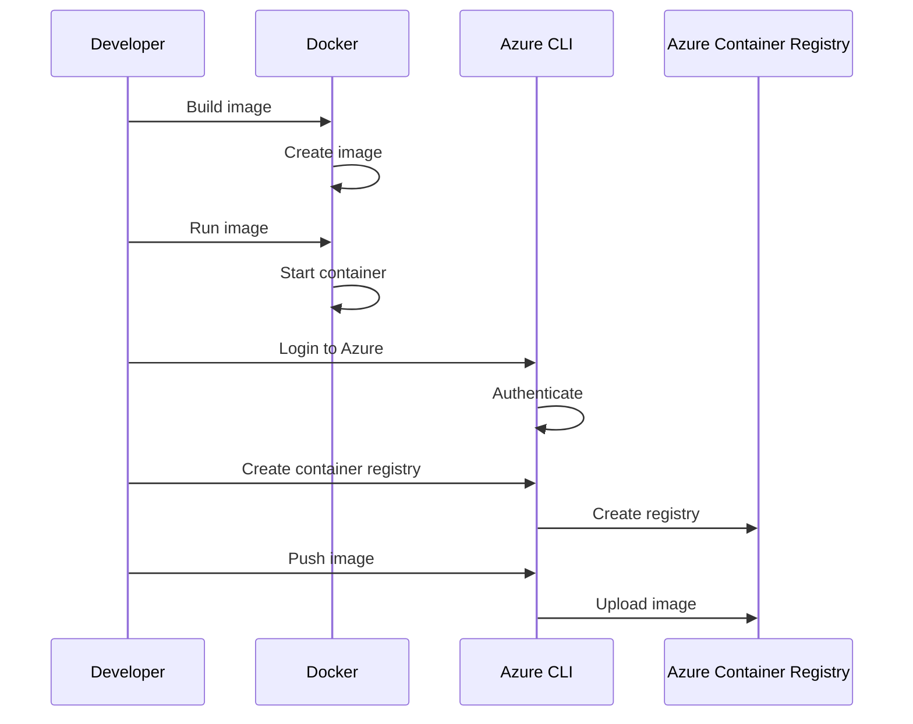
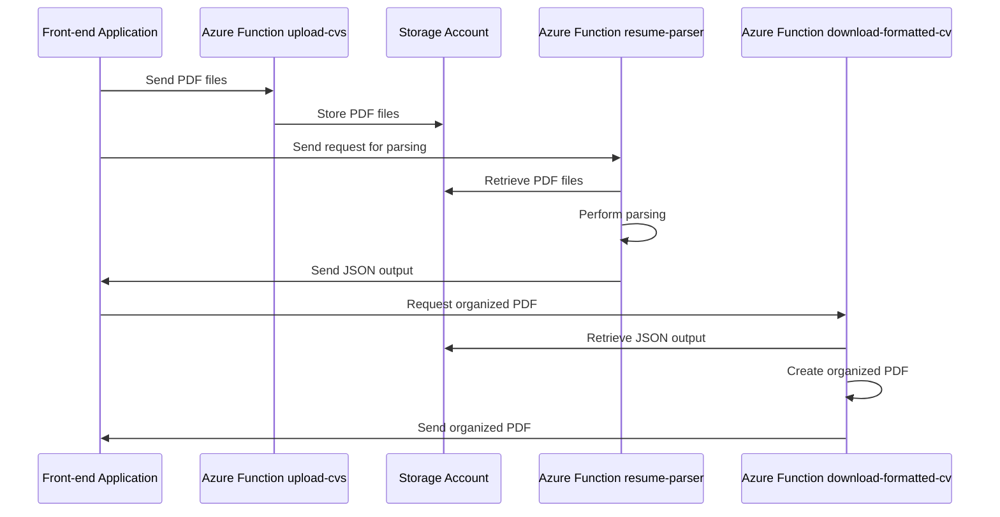

# Docker

## Docker Simple Commands 

* ``` docker run ```     Runs a command in a new container
* ``` docker start ```   Starts one or more stopped containers
* ``` docker stop ```    Stops one or more running containers
* ``` docker build ```   Builds an image from a Dockerfile
* ``` docker pull ```    Pulls an image or a repository from a registry
* ``` docker push ```    Runs a command in a new container
* ``` docker exec ```    Removes one or more containers
* ``` docker rm ```      Runs a command in a new container
* ``` docker rmi ```     Removes one or more images
* ``` docker ps ```      Lists all running containers
* ``` docker images ```  Lists all images on the host
* ``` docker logs ```    Shows the logs of a container
* ``` docker inspect ``` Shows detailed information on one or more containers or images

## Push Docker to Azure Registry

Example with an image called resumeparser and an azure container registry called resumeparsercontainer

docker build -t resume-parser .
docker run --name resume-parser-c -p 8080:80 -d -v ${pwd}:/home/site/wwwroot resume-parser
docker tag resume-parser resumeparser.azurecr.io/resume-parser 
docker push resumeparser.azurecr.io/resume-parser 


|                           |                                                                                              |  
|--------------------------:|----------------------------------------------------------------------------------------------|
| build image               | `docker build -t resume-parser .`                                                            |
| run image                 | `docker run --name resume-parser-c -p 8080:80 -d -v ${pwd}:/home/site/wwwroot resume-parser` |
| login to Azure            | `az login`                                                                                   |
| login to Azure registry   | `az acr login --name resumeparser`                                                           |
| Create container registry | `az acr create -n myregistry -g myresourcegroup`                                             |
| Tag the image             | `docker tag resume-parser resumeparser.azurecr.io/resume-parser`                             |
| Push image                | `docker push resumeparser.azurecr.io/resume-parser `                                         |
| Pull image                | `docker pullresumeparser.azurecr.io/resume-parser `                                          |
| Ls images of Az registry  | `az acr repository list --name resumeparser`                                                 |
| Delete a container in AZ  | `az acr repository delete --name resumeparser --image resumeparser`                          |







###### Final Notes see:
https://mermaid.js.org/syntax/flowchart.html
